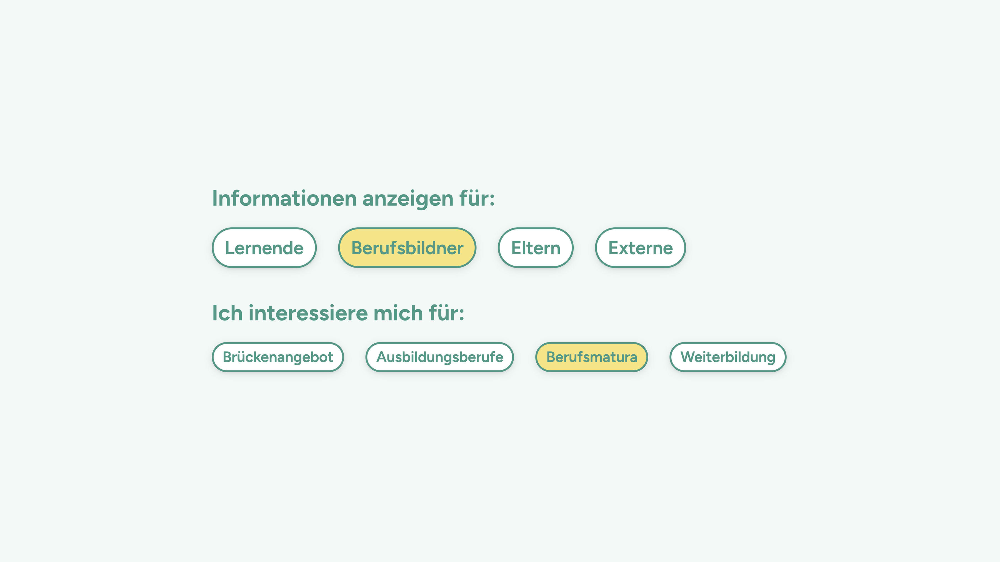
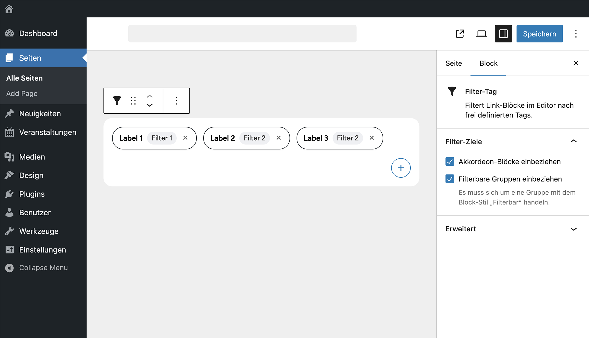
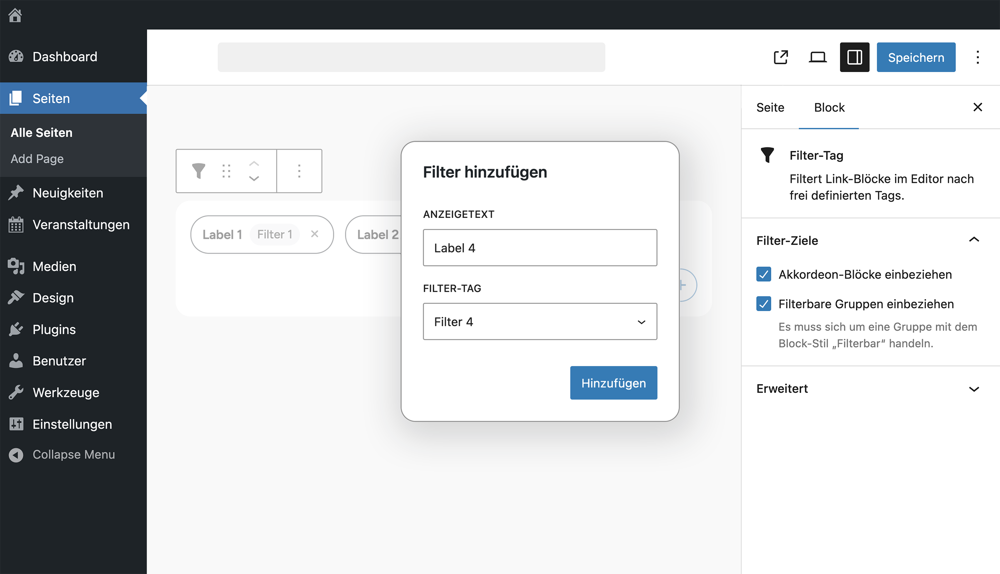

# UD Block: Filter Tag 

Block zur Filterung von `wp-block-ud-link-block`-Elementen direkt im Editor anhand frei definierbarer Tags.
Unterstützt auch die Filterung innerhalb von Akkordeon-Blöcken und filterbaren Gruppen.


## Funktionen
- Filtert `UD Link Blocks` anhand zentral verwalteter Tags
- Tags stammen aus dem REST-Endpunkt `/wp-json/ud-shared/v1/tags`
- Mehrere Filter kombinierbar und sortierbar
- Unterstützt zwei Zieltypen: filterbare Gruppen und Akkordeon-Blöcke
- Komplette Konfiguration im Gutenberg-Editor
- REST-basiertes Laden der verfügbaren Tags
- Vollständig kompatibel mit dem `ud-accordion-block`
- Automatisches Öffnen von Akkordeons mit sichtbaren Treffern
- Unterstützt Drag & Drop zum Sortieren der Filter


## Screenshots

*Filter-Ansicht im Frontend*



*Übersicht mit konfigurierten Filtern und Zielauswahl*


*Eingabe eines neuen Filters (Label + Tag)*


## Filterziele

Die Filter wirken auf zwei verschiedene Zieltypen, die im Block-Inspector aktiviert werden können.

### Filterbare Gruppen

- Funktioniert mit dem WordPress-Block `core/group`
- Der Gruppen-Block muss den Stil „Filterbar“ tragen
- Dieser Stil wird durch dieses Plugin mitgeliefert
- Die Filterung erfolgt via Isotope (`layoutMode: masonry`)

### Akkordeon-Blöcke

- Wird unterstützt, wenn das Plugin `ud-accordion-block` installiert ist
- Akkordeons mit sichtbaren Treffern werden automatisch geöffnet
- Verschachtelungen werden korrekt behandelt


## Technische Hinweise

- Die verfügbaren Tags werden automatisch über folgenden Endpunkt geladen:

    ```
    /wp-json/ud-shared/v1/tags
    ````

    Dieser Endpunkt wird vom Plugin **Shared API** bereitgestellt.
    Ist dieses Plugin aktiv, steht die Tag-Liste ohne weitere Konfiguration zur Verfügung.

- Authentifizierung erfolgt über Nonce:
    ```js
    window.udLinkBlockSettings.nonce
    ````

- Das Plugin ud-link-block registriert seine Tags in der Shared-API. Weitere Plugins können Tags hinzufügen, indem sie denselben Endpunkt erweitern.


## Autor

[ulrich.digital gmbh](https://ulrich.digital)


## Lizenz

GPL v2 or later
[https://www.gnu.org/licenses/gpl-2.0.html](https://www.gnu.org/licenses/gpl-2.0.html)


